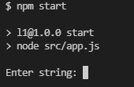
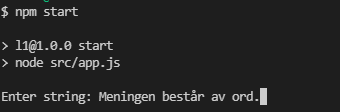
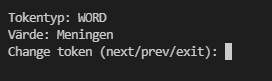
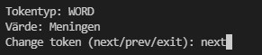
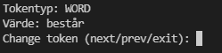
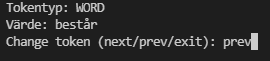
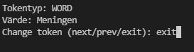
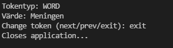

# Tokenizer

## Instruktioner

## Skapa grammatik
* Skapa en javascript fil (grammatiknamn.js) i /src/grammars
* Skapa ett objekt som exporteras:
```javascript
export const grammatiknamn = {}
```
* Varje nyckel i objektet är en token typ och värdet är regex för token typen:
```javascript
export const grammatiknamn = {
  "WORD": /^[\w|åäöÅÄÖ]+/,
  "DOT": /^\./
}
```

## Tokenizer (om TokenizerUI inte används!)
* Skapa en app.js modul i /src
* Importera tokenizer.js och en grammatik:
```javascript
import { Tokenizer } from './tokenizer.js'
import { wordAndDotGrammar } from './grammars/wordAndDotGrammar.js'
```
* Skapa en instans av Tokenizer med grammatiken som argument:
```javascript
import { Tokenizer } from './tokenizer.js'
import { wordAndDotGrammar } from './grammars/wordAndDotGrammar.js'

const tokenizer = new Tokenizer(wordAndDotGrammar)
```
* För att starta tokeniseraren, skapa en sträng och skicka med den i ett argument till startTokenizer:
```javascript
import { Tokenizer } from './tokenizer.js'
import { wordAndDotGrammar } from './grammars/wordAndDotGrammar.js'

const tokenizer = new Tokenizer(wordAndDotGrammar)

tokenizer.startTokenizer("Meningen består av ord.")
```
* För läsa aktivt token anropa getActiveToken:
```javascript
import { Tokenizer } from './tokenizer.js'
import { wordAndDotGrammar } from './grammars/wordAndDotGrammar.js'

const tokenizer = new Tokenizer(wordAndDotGrammar)

console.log(tokenizer.getActiveToken())
```
* För att läsa och ändra till nästa token:
```javascript
import { Tokenizer } from './tokenizer.js'
import { wordAndDotGrammar } from './grammars/wordAndDotGrammar.js'

const tokenizer = new Tokenizer(wordAndDotGrammar)

console.log(tokenizer.getNextToken())
```
* För att läsa och ändra till förra token:
```javascript
import { Tokenizer } from './tokenizer.js'
import { wordAndDotGrammar } from './grammars/wordAndDotGrammar.js'

const tokenizer = new Tokenizer(wordAndDotGrammar)

console.log(tokenizer.getPrevToken())
```

## TokenizerUI
* Skapa en app.js modul i /src
* Importera tokenizerUI.js och en grammatik:
```javascript
import { TokenizerUI } from './tokenizerUI.js'
import { wordAndDotGrammar } from './grammars/wordAndDotGrammar.js'
```
* Skapa en instans av TokenizerUI med gramamtiken som argument:
```javascript
import { TokenizerUI } from './tokenizerUI.js'
import { wordAndDotGrammar } from './grammars/wordAndDotGrammar.js'

const ui = new TokenizerUI(wordAndDotGrammar)

```
* Starta TokenizerUI:
```javascript
import { TokenizerUI } from './tokenizerUI.js'
import { wordAndDotGrammar } from './grammars/wordAndDotGrammar.js'

const ui = new TokenizerUI(wordAndDotGrammar)
ui.start()
```
* Ange sträng visas i terminalen:


* Ange sträng och tryck enter:


* Första aktiva strängen visas:


* Skriv next och tryck enter för att ändra till nästa token:


* Nästa token visas:


* Skriv prev och tryck enter för att ändra till förra token:


* Förra strängen visas:


* Skriv exit och tryck enter för att stänga applikationen:


* Appliationen stängs:

