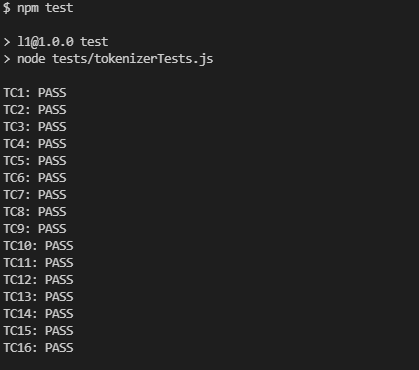

# Mall för inlämning laboration 1, 1dv610

## Checklista
  - [x] I min tokeniserare finns inga tokentyper eller reg-exp. Dessa finns i mitt testprojekt eftersom de skapas utav användaren.
  - [x] Jag har skrivit all kod och reflektioner själv. Jag har inte använt mig av andras kod för att lösa uppgiften.
  - [x] Mina testresultat är skrivna utifrån utförd testning ( och inte teoretiskt, det bör fungera :) )
  - [x] De enda statiska metoder eller funktioner utanför klasser som jag har är för att starta upp min testapplikation ex main(java).
  - [x] De enda bibliotek och färdiga klasser som används är sådana som måste användas (eller som används för att testa modulen).

## Egenskattning och mål
  - [ ] Jag är inte klar eftersom jag vet att jag saknar något. Då skall du inte lämna in!
  - [x] Jag eftersträvar med denna inlämning godkänt betyg (E-D)
    - [x] De flesta testfall fungerar
    - [x] Koden är förberedd på Återanvändning
    - [x] All kod samt historik finns i git 
    - [x] Kodkvaliterskraven är ifyllda
    - [x] Reflektion är skriven
  - [ ] Jag eftersträvar med denna inlämning högre betyg (C-B) och anser mig uppfylla alla extra krav för detta. 
    - [ ] Samtliga testfall är skrivna
    - [ ] Egna testfall för Maximal munch och kantfall
    - [x] Testfall är automatiserade
    - [x] Det finns en tydlig beskrivning i hur modulen skall användas (i git)
    - [x] Kodkvalitetskraven är varierade 
  - [ ] Jag eftersträvar med denna inlämning högsta betyg (A) 

Förtydligande: Examinator kommer sätta betyg oberoende på vad ni anser. 

## Återanvändning
<!-- Beskriv hur du anpassat din kod och instruktioner för att någon annan programmerare skall kunna använda din tokenizer. Om du skrivit instruktioner för din användare länka till dessa. Om inte beskriv här hur någon skall göra för att använda din kod med sin egen grammatik.  -->
Koden har anpassats för återanvändning genom att Tokenizer klassen inte har några beroende till någon av mina andra klasser. Tokenizerns enda uppgift är att tokenizera strängen enligt en grammatik och en textsträng. Alla tokens kan sedan hämtas från Tokenizer genom att gå fram och tillbaks med getNextToken, getPrevToken och getActiveToken. Instruktioner hur man använder tokeniseraren finns i [README.md](./README.md)

## Beskrivning av min kod
<!-- Beskriv din kod på en hög abstraktionsnivå. En kort beskrivning av dina viktigaste klasser och metoder. Skapa gärna ett klassdiagram som bild.  -->
Koden består av två huvudklasser (tokenizer och tokenizerUI).

Tokenizer är den klass som tar emot ett token och en grammatik för att sedan tokenisera strängen enligt grammatiken. Tokenizer kan sedan användas för att läsa aktivt token, läsa nästa token eller lösa föregående token.

TokenizerUI är den klass som hanterar användargränssnittet. klassen använder sig av terminalen för visa och fråga användaren om data. Användaren kan även gå fram och tillbaks mellan olika aktiva token med hjälp av terminalen.

## Hur jag testat
<!-- Beskriv hur du kommit fram till om din kod fungerar. -->
Koden har testats med automatiska testfall i modulen tokenizerTests. Varje testfall är en funktion som skapar ett tokenizer objekt. Sedan startar funktionen tokeniseraren genom att anropa startmetoden med en testfallets sträng som argument. Sedan anropar funktionen next/prev metoderna enligt sekvensen i testfallet och jämför resultatet med det förväntade genom att anropa metoden getActiveToken.

## Testfall
<!-- Lista de enskilda testfallen. **Fetmarkera** sådant som du själv fyllt i. En rad per testfall. -->

| Namn      | Grammatik | Sträng | Sekvens | Förväntat Aktivt Token | PASS/FAIL |
| --------- | --------- | ------ | ------- | ------------ | --------- |
|    TC1       |   WordAndDotGrammar        |  “a”      |   []      |     WORD(“a”)         |        PASS   |
|    TC2      |   WordAndDotGrammar        |   “a aa”     |  [>]       |      WORD(“aa”)        |      PASS     |
|   TC3        |  WordAndDotGrammar         |   “a.b”     |   [>]      |       DOT(“.”)       |      PASS     |
|   TC4        |   WordAndDotGrammar        |  “a.b”    |   [>>]      |      **WORD(“b”)**        |    PASS       |
|   TC5        |   WordAndDotGrammar        |  “aa. b”   |   **[>>]**      |     WORD(“b”)         |      PASS     |
|   TC6        |   WordAndDotGrammar        |  “a .b”    |   [>><]      |       DOT(“.”)       |      PASS     |
|   TC7        |   WordAndDotGrammar        |   “”    |     []    |       END       |      PASS     |
|   TC8        |   WordAndDotGrammar        |   “ ”    |    []     |       **END**       |      PASS     |
|   TC9        |   WordAndDotGrammar        |   “a”    |     **[>]**    |        END      |      PASS     |
|   TC10        |  WordAndDotGrammar         |  “a”     |[<]|         **END**     |       PASS    |
|   TC11        |  WordAndDotGrammar         |   “!”    |     []    |    Exception      |      PASS     |
|   TC12        |  ArithmeticGrammar         |   “3”     |     []    |  NUMBER(“3”)   |     PASS      |
|   TC13        |  ArithmeticGrammar         |   “3.14”     |   []      |    NUMBER()   |        PASS   |
|   TC14        |  ArithmeticGrammar         |    “3 + 54 * 4”    |  [>>>]  |  MUL(“*”)  |   PASS     |
|   TC15        |  ArithmeticGrammar         |   “3+5 # 4”     |[>>>]|   **LexicalError(“No lexical element matches "# 4"”)**   |      PASS     |
|   TC16        |  ArithmeticGrammar         |“3.0+54.1     + 4.2”|[><>>>]|  **ADD(“+”)**  |    PASS       |

### Resultat:

<!-- Du kan tillföra kommentarer om din tokeniserare skiljer sig något från standard.  -->

<!-- ### Testfall för högre betyg

Lista de enskilda testfallen. En rad per testfall.
| Namn      | Grammatik | Sträng | Sekvens | Förväntat Aktivt Token | PASS/FAIL |
| --------- | --------- | ------ | ------- | ------------ | --------- |
|           |           |        |         |              |           | -->

## Kodkvalitetskrav

<!-- **Fetmarkera** de "regler" som används ur CC. Ni kan frångå tabellformat om ni vill. Skapa direktlänkar till er kod där det är lämpligt.  -->

### Namngivning

| Namn och förklaring  | Reflektion                                   |
| -------------------  | ---------------------------------------------|
| startTokenizer, metoden som startar Tokenizer.                     | **Use Intention-Revealing Names**, Metodnamnet består av två ord: start och tokenizer. Dessa två ord visar tydligt att avsikten är att starta tokenizer.  **Use Pronounceable names**. Metodnamnet använder sig av två engelska ord, vilket gör metodnamnet uttalbart.                                            |
|    tokenizerResultTokens, Ett attribut i Tokenizer                 |       **Avoid Mental Mapping**, attributets namn berättar tydligt att den innehåller tokeniserarens resultat med ordet Result. Det blir därför tydligare för exempelvis andra programmerare att veta vad attributet innehåller.                                        |
|    getBestTokenMatch, En metod i Tokenizer som returnerar det token som matchar bäst                  |      **Pick One Word per Concept**, Metodnamnet börjar med get, vilket indikerar att den returnerar något. Enligt namnet returneras bästa token matchningen. I modulen Tokenizer används endast get för att indikera att något för att få data, vilket gör det tydligare än att exempelvis blanda get, fetch och retrieve. **Pronounceable names**. Metodens namn innehåller endast riktiga ord, vilket gör namnet uttalbart.                     |
|    Tokenizer, namnet på klassen som tokeniserar tokens.                  |      **Class Names**, namnet på en klass ska vara ett substantiv eller en substantivfras, vilket namnet Tokenizer uppfyller                                        |
|    token, en variabel i metoden handleError i Tokenizer.                  |       **Use Intention-Revealing Names**, variabeln används för att skicka ett token som skapas i createLexicalErrorToken till metoden addToken på nästa rad. Ett bättre alternativ hade varit att ändra namnet till lexicalErrorToken eftersom det förklarar innehållet bättre.                                    |

### Funktioner

| Metodnamn och förklaring  | Reflektion                                   |
| -------------------  | ---------------------------------------------|
|   createTokenTypeMatchObject(key, matchString), en metod som returnerar ett av två token objekt beroende på om värdet är en tom sträng eller inte i Tokenizer.                   | **Do One Thing**, Metoden gör en sak eftersom den skapar ett token objekt. **Function Arguments**, Metoden har två argument (dyadic), vilket är sämre än att ha ett argument. Eftersom båda argumenten krävs för att skapa objektet så är det ett undantag.                                      |
|   getBestTokenMatch(), en metod i Tokenizer som returnerar det token som matchar bäst enligt regeln längst värde.                   |    **Do One Thing**, Metoden gör flera saker. Den skapar både ett token och letar upp det token som matchar bäst. Ett bättre alternativ hade varit att skapa ett token i en annan metod med hjälp av ett metodanrop. **One Level of Abstraction per Function**, Metoden skapar nåde ett objekt och anropar metoder. Det innebär att det finns både höga och låga abstraktionsnivåer i samma metod. En bättre lösning är att flytta ut skapandet av objektet till en separat metod.                                   |
|  startTokenizer(), en metod som startar tokeniseraren i Tokenizer                    |    **One Level of Abstraction per Function**, Metoden anropar endast andra metoder utan några abstraktioner på en låg nivå.                                          |
|   createAllTokens(), en metod i Tokenizer som skapar alla tokens.                   |  **Blocks And Indenting**, En while loop rekommenderas endast att ha ett metodanrop i blocket. While loopen i createAllTokens innehåller fem metodanrop. En bättre lösning hade varit att skapa en metod som heter createToken som loopen anropar varje iteration.                                            |
|    getNextToken(), en metod i Tokenizer som hämtar nästa token och uppdaterar aktiv token                  |    **Have No Side Effects**, Metoden heter getNextToken men utöver att hämta nästa token så ändras även det token som är aktivt. Detta skapar en sidoeffekt. Däremot har jag valt att inte ändra metoden, eftersom två metodanrop (ändra till nästa token och hämta nästa token) skulle skapa sämre kod för den som använder klassen.                                          |

## Laborationsreflektion
<!-- Reflektera över uppgiften utifrån ett kodkvalitetsperspektiv. Använd begrepp ifrån boken.  -->
Uppgiften följer bokens krav för kodkvalitet, men vissa delar av koden skulle kunna förbättras. Boken nämner att block innanför if, else och while satser bara ska vara en rad. I flera av mina metoder (getNextToken, getPrevToken, handleError och createAllTokens) är blocken många rader. Detta skulle kunna förbättras genom att skapa separata metoder för varje block. T.ex. i createAllTokens skulle varje iteration kunna anropa metoden createToken. Blocken i getPrevToken och getNextToken skulle kunna anropa en metod som ändrar token och returnerar det. I handleError skulle if blocket kunna brytas ut till en egen metod för att minska mängden kod i metoden. De flesta metoderna har inte blandade abstraktionsnivåer. Detta beror på att man inte ska ha olika abstraktionsnivåer i en metod. I getBestTokenMatch och createEndToken skapas objekt i samma metod som andra anropas. En bättre lösning hade varit att skapa en metod med en lägre abstraktionsnivå som som skapar alla token objekt. Boken beskriver att sidoeffekter uppstår när exempelvis en metod gör något som inte beskrivs. I uppgiften förekommer en sidoeffekt i getNextToken och getPrevToken, eftersom dessa metoder utöver att returnera ett token även ändrar vilket token som är aktivt i Tokenizer. Den bästa lösningen hade varit att ha två metoder, men det skulle göra klassen svårare att använda för andra. Eftersom det i så fall skulle behöva göra två anrop för att ändra token. En bättre lösning hade varit att förtydliga att även aktivt token ändras i metodnamnet.